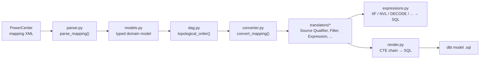

# Informatica dbt Bridge

Converts **Informatica PowerCenter** mapping XML exports into equivalent **dbt** SQL models.

## The problem

Teams moving off PowerCenter onto a modern, SQL-first ELT stack (dbt) usually migrate mappings by
hand: open the mapping in Designer, read the transformation chain, and manually rewrite it as SQL.
That's slow, error-prone, and undocumented — nothing records *why* a given CTE matches a given
PowerCenter transformation, so review requires trusting the migrator got it right.

This tool automates the mechanical part: it parses a mapping export, walks its transformation
graph, and emits a dbt model where each CTE is named after — and traceable back to — the
PowerCenter transformation it came from. What it can't safely automate (stored procedures,
`ERROR()`/`ABORT()` calls, unrecognized expression functions, …) it flags with a `TODO` instead of
guessing, so a human reviewer always knows what still needs their attention.

## How it works



1. **Parse** the XML into a typed domain model (`SOURCE`/`TARGET`/`TRANSFORMATION`/`CONNECTOR`).
2. **Order** the transformation graph with a topological sort over `CONNECTOR` edges.
3. **Translate** each transformation into a CTE — one translator per PowerCenter `TYPE`, dispatched
   from `converter.py`. Expression-language calls (`IIF`, `NVL`, `DECODE`, ...) get their own
   recursive translator; anything unrecognized is left verbatim and reported, never guessed.
4. **Render** the ordered CTEs into a single dbt model SQL file.

Full design rationale, alternatives considered, and non-goals are in [`architecture.md`](architecture.md).

## Status

Working today: parsing, DAG ordering, and translators for **Source Qualifier**, **Filter**, and
**Expression**, wired end-to-end through `convert_mapping()` — TDD throughout, see `git log`.

Not yet built: Aggregator/Lookup/Joiner/Union/Router/Rank translators, `schema.yml` and
migration-report generation, a CLI, and an executable dbt/DuckDB integration test.

## Getting started

```bash
uv sync
uv run pytest              # 52 tests
uv run coverage report -m  # 94% branch coverage
```

```python
from informatica_dbt_bridge.converter import convert_mapping

result = convert_mapping(xml_text, source_system="erp")
print(result.sql)  # the generated dbt model
```
