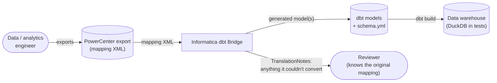

# High-level architecture

System context: who uses this, what it consumes, and what it produces. For design
rationale and trade-offs, see [`architecture.md`](../../architecture.md).

## What it does

Converts a PowerCenter mapping export into an equivalent dbt SQL model, so migrating off
PowerCenter doesn't mean manually retranscribing every transformation by hand. See the
README's "[The problem](../../README.md#the-problem)" for the full motivation.

## Boundaries

- **In**: one mapping's XML (`SOURCE`/`TARGET`/`TRANSFORMATION`/`CONNECTOR`).
- **Out**: dbt model SQL text, plus a list of `TranslationNote`s for anything it couldn't
  safely translate — never a silent guess.
- **Not this system's job**: running dbt, talking to a warehouse, or interpreting
  `SESSION`/`WORKFLOW` orchestration XML (that's scheduling metadata, not transformation
  logic — see `architecture.md`'s non-goals).

## Components

| Component | Responsibility |
|---|---|
| `parser.py` | XML → typed domain model. The only module that touches `ElementTree`. |
| `dag.py` | Orders transformations by their `CONNECTOR` dependencies. |
| `converter.py` | Orchestrates parse → order → translate → render. |
| `translators/*.py` | One translator per PowerCenter transformation `TYPE`. |
| `expressions.py` | Informatica expression-language → SQL. |
| `render.py` | Assembles translated CTEs into the final model SQL. |

Full internal structure: [`low-level/converter.md`](low-level/converter.md).
