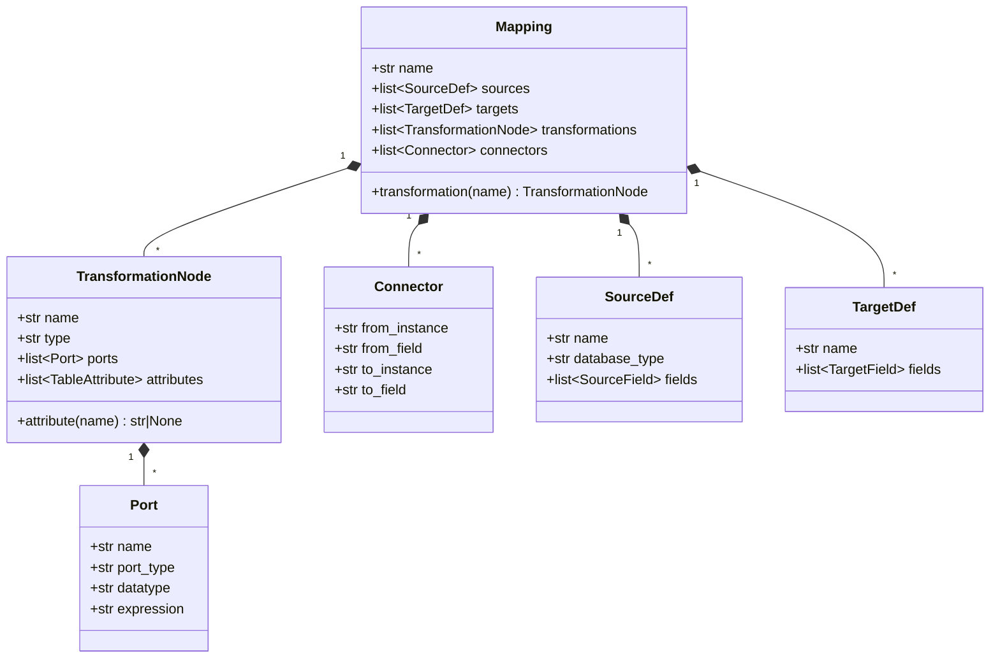
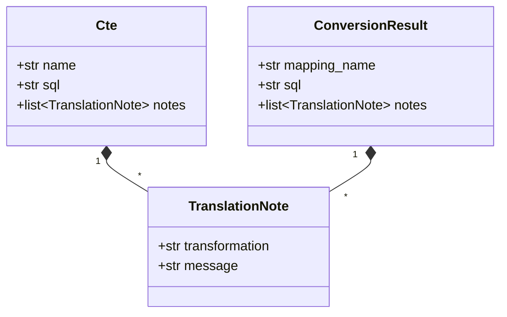
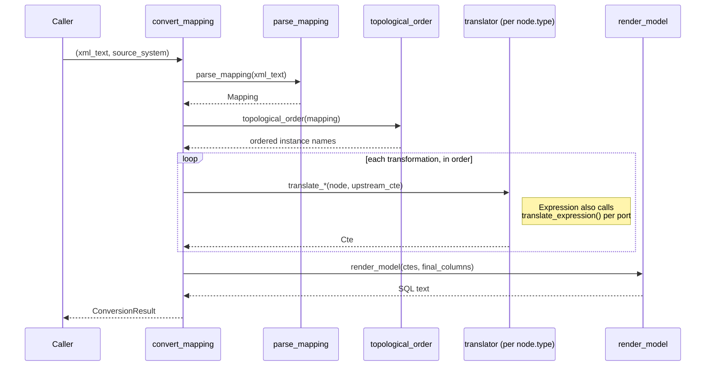
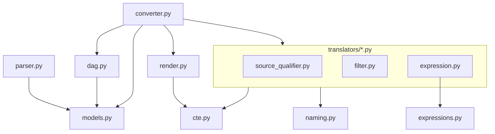

# Low-level design: the converter

Internal structure of `src/informatica_dbt_bridge/`. Ground truth is the code; if this
drifts from it, trust the code and fix this file.

## Domain model

`parser.py` builds this from the raw XML; everything downstream operates on it instead of
`ElementTree` elements.

## Translation intermediate representation

Every translator (`translators/*.py`) returns a `Cte`; `converter.py` collects their
`TranslationNote`s into the final `ConversionResult`.

## `convert_mapping()` call sequence

Notes on the dispatch step (`converter._translate_node`):

- `Source Qualifier` always goes to `translate_source_qualifier` — it has no upstream CTE.
- `Filter`/`Expression` require an upstream CTE, resolved from `CONNECTOR` edges
  (`converter._build_upstream_map`). Fan-in (two upstreams into one node) raises
  `NotImplementedError` — that needs Joiner/Union support, which doesn't exist yet.
- Any other `TYPE` falls back to `converter._unsupported`: a `TODO`-commented passthrough
  CTE plus a `TranslationNote`, never a silently dropped node.

## Module dependencies

