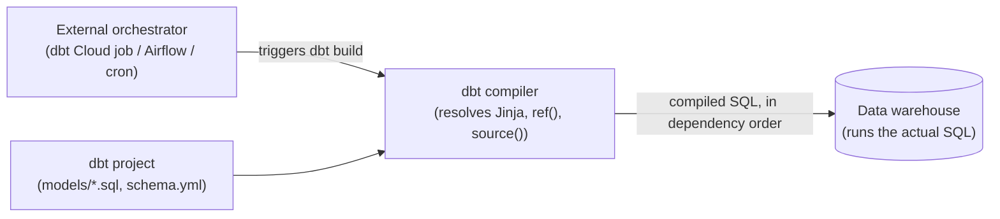
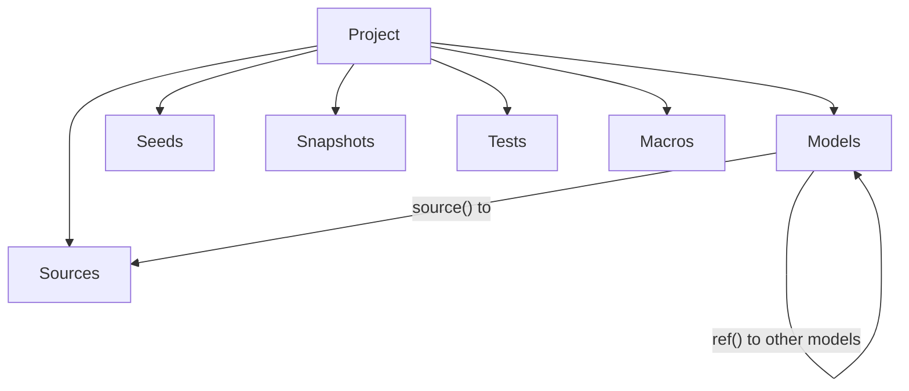

# dbt, quickly

For data engineers who know SQL and warehouses but have never used dbt. Skips "what is
ELT" and goes straight to dbt's vocabulary and execution model.

## What it is

dbt (data build tool) is a transformation framework: you write SQL `select` statements,
dbt turns them into tables/views, figures out the dependency order between them, and adds
version control, testing, and documentation on top. There's no separate execution engine —
dbt compiles your SQL (resolving Jinja and dependency references) and hands it straight to
the warehouse, which does all the actual computation. dbt itself never touches a row of
data.

**dbt Core** is the open-source CLI; **dbt Cloud** is a managed layer around it (scheduling,
IDE, hosted docs). Either way, a **project** is just a directory of files plus a connection
config (`profiles.yml`) — no separate metadata database, unlike PowerCenter's Repository.
An **adapter** per warehouse (Snowflake, BigQuery, Databricks, DuckDB, Postgres, Redshift,
...) translates dbt's generic SQL into that warehouse's dialect.

## Architecture at a glance

## The data model

| Object | What it actually is |
|---|---|
| **Model** | A `.sql` file = one `select` statement = one table/view dbt manages. The direct analog of a PowerCenter Mapping+Target — but it's just SQL, no visual graph. |
| **Source** | A declaration that an existing raw table exists — dbt doesn't create it, just documents and tests it (`sources:` in a `schema.yml`). Referenced in SQL as `{{ source('name', 'table') }}`. PowerCenter's `SOURCE`, essentially. |
| **`ref()`** | `{{ ref('other_model') }}` — compiles to that model's real table/view name *and* creates a dependency edge. dbt's DAG is built implicitly from every `ref()`/`source()` call in the project, not drawn by hand like a PowerCenter mapping's connectors. |
| **Materialization** | Config on a model controlling what SQL dbt actually issues: `view` (a `CREATE VIEW`), `table` (`CREATE TABLE AS`), `incremental` (`MERGE`/`INSERT` of only new/changed rows), `ephemeral` (inlined as a CTE into whatever references it, nothing persisted). Roughly PowerCenter's Session load type + Update Strategy, combined. |
| **Seed** | A checked-in CSV dbt loads as a table — for small, static reference data. |
| **Snapshot** | Point-in-time history capture (SCD Type 2) — dbt's built-in answer to slowly changing dimensions. |
| **Test** | An assertion that must hold: schema tests (`unique`, `not_null`, `accepted_values`, `relationships`) declared in YAML, or a custom SQL query ("singular test") that must return zero rows. Run every `dbt build`, not just on write. |
| **Macro** | A reusable Jinja+SQL snippet — a function you can call from any model. PowerCenter's Mapplet, but as code, not a visual sub-graph. |
| **`schema.yml`** | Where sources, model/column descriptions, and tests are declared — also feeds the generated docs site. |

## Row-level logic

There's no separate expression language. Derived columns are just SQL (`CASE WHEN`,
`COALESCE`, warehouse-native functions) inside the `select`. **Jinja** (`{{ }}`, ``)
is the only templating layer on top — control flow, macros, `var()` — and it's fully
compiled away into plain SQL before anything runs.

## How data actually moves

`dbt run` (or `dbt build`, which also runs tests/seeds/snapshots) compiles every model's
SQL — resolving `ref()`/`source()` into real relation names and evaluating Jinja —
topologically sorts the resulting DAG, and executes each model's SQL directly against the
warehouse via the adapter. The warehouse does 100% of the actual computation; dbt is purely
an orchestration and compilation layer, unlike PowerCenter where the Integration Service
*is* the compute engine.

## Orchestration

dbt Core has no built-in scheduler — something external (a dbt Cloud job, Airflow,
Dagster, plain cron) has to trigger `dbt build`. This is a deliberate design choice, unlike
PowerCenter, which bundles orchestration (Workflow Manager) into the same product as
transformation logic (Designer).

## Quick terms → PowerCenter equivalents

| dbt | Roughly maps to (PowerCenter) |
|---|---|
| Model | Mapping (+ its Target) |
| `source()` | Source |
| `materialized='incremental'` | Session load type + Update Strategy |
| Macro | Mapplet |
| `var()` | Mapping variable |
| Test | Session-level reject handling / target constraints, but explicit and versioned |
| — (deliberately absent) | Workflow — orchestration is left to an external tool |

## Further reading

- [What is dbt](https://docs.getdbt.com/docs/introduction)
- [About dbt models](https://docs.getdbt.com/docs/build/models)
- [SQL models](https://docs.getdbt.com/docs/build/sql-models)
- [Quickstart guides](https://docs.getdbt.com/guides)
- [Jaffle shop reference project (runs locally with DuckDB)](https://github.com/dbt-labs/jaffle_shop_duckdb)
