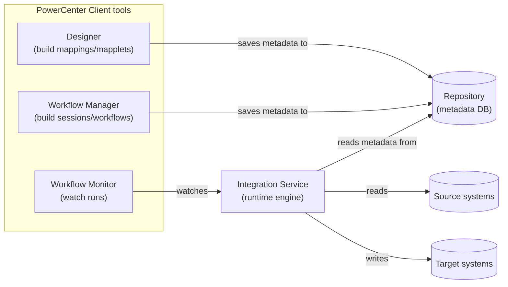
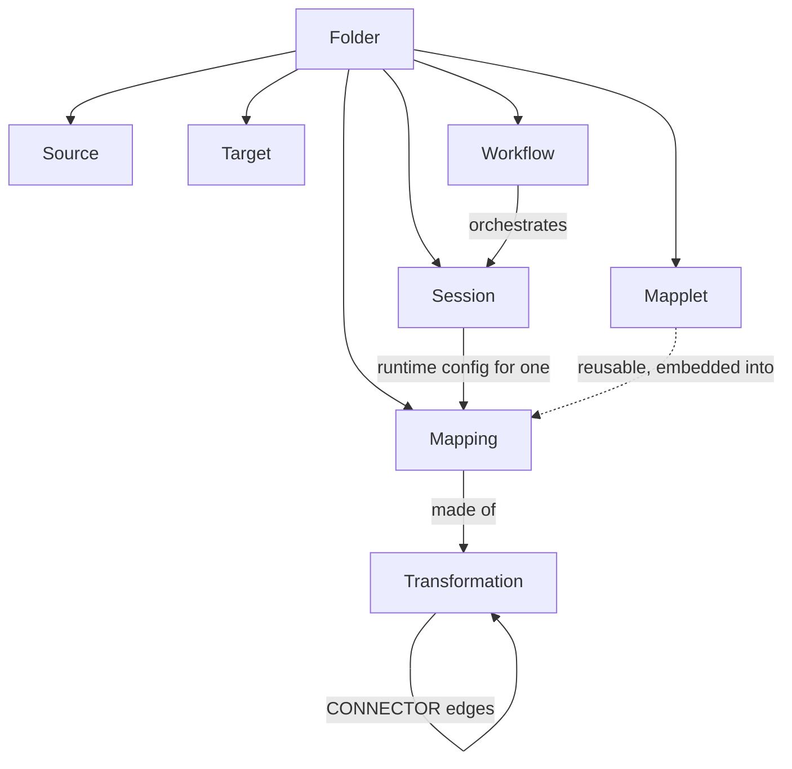

# Informatica PowerCenter, quickly

For data engineers who know ETL/ELT concepts but have never opened PowerCenter. Skips
"what is ETL" and goes straight to PowerCenter's own vocabulary and how it actually moves
data — that's the part that doesn't transfer from modern tools.

## What it is

PowerCenter is a GUI-driven, client/server ETL platform from Informatica, common as the
ETL backbone in large enterprises (banking, insurance, telecom) since the late 1990s.
Pipelines are built visually — drag transformation icons onto a canvas, draw connections
between them — not written as code. That visual graph, not SQL, is the primary artifact.

## Architecture at a glance

The **Repository** is just a metadata store (itself a relational database) — it holds
*definitions*, not data. The **Integration Service** is the engine that actually reads
metadata out of the Repository and moves rows at runtime.

## The data model

Everything lives in a **Repository**, organized into **Folders** (roughly: a project/team
namespace). Inside a folder:

| Object | What it actually is |
|---|---|
| **Source** | Metadata for an upstream table/file (column names, types) — no data, just a definition imported from the source system. |
| **Target** | Same, for the destination table. |
| **Mapping** | The unit of transformation logic: a DAG of **Transformations**, wired together by **Connectors**, from Source(s) to Target(s). This is the closest thing to a dbt model — but expressed as a visual graph, not SQL. |
| **Transformation** | One node in that DAG. Each has typed **ports** (input/output columns) and its own config. Common types: Source Qualifier (the initial read — generates the actual SQL against the source), Expression (row-level derived columns, passive), Filter, Router, Joiner, Lookup, Aggregator, Sorter, Rank, Union, Sequence Generator, Update Strategy, Normalizer. |
| **Connector** | An edge: `(transformation, output port) → (transformation, input port)`. The full set of connectors in a mapping *is* its dataflow graph. |
| **Mapplet** | A reusable sub-graph of transformations, embeddable into multiple mappings — PowerCenter's version of a shared function/macro. |
| **Session** | Runtime configuration bound to exactly *one* mapping: connection details, caching, partitioning, error handling, load type. A mapping isn't runnable on its own — it needs a session. |
| **Workflow** | An orchestration DAG of **Tasks** (Session, Email, Command, Decision, Event-Wait, ...) with links and conditions — this is PowerCenter's Airflow-equivalent, bundled into the same tool. Runs on a schedule via the Integration Service. |
| **Worklet** | A reusable sub-workflow, same idea as a Mapplet but for orchestration. |
| **Mapping variable/parameter** | A named value (`$$VarName`) settable at session/workflow/`pmcmd`-invocation level and referenced inside mapping expressions — PowerCenter's equivalent of a dbt `var()`. |

## How data actually moves

This is the biggest mental-model shift coming from SQL-first tools: the Integration
Service pulls rows out of the source via the Source Qualifier's generated SQL, then
streams them **row-by-row (in blocks) through the transformation pipeline in its own
external engine**, writing to the target as it goes. It's not set-based SQL running in the
warehouse — PowerCenter *is* the compute engine, sitting outside both source and target.
(This is exactly why migrating to dbt is a real architecture change, not a syntax
translation: dbt pushes every model down as one SQL statement the warehouse executes
itself.)

## Expression language

Row-level logic (inside Expression, Filter, Aggregator, Rank transformations) is written
in PowerCenter's own proprietary functions — `IIF(cond, a, b)`, `DECODE(...)`, `NVL(...)`,
`:LKP.name(...)` for an unconnected lookup — not SQL. It's evaluated by the Integration
Service at runtime, not pushed to any database.

## Exporting

Repository Manager (or the `pmrep objectexport` CLI) can export folders/mappings/workflows
as XML (the `POWERMART`/`powrmart.dtd` schema) — this is the artifact this project's
converter reads.

## Quick terms → dbt equivalents

| PowerCenter | Roughly maps to (dbt) |
|---|---|
| Mapping | Model (`.sql` file) |
| Source | `source()` |
| Target | The model's materialized table/view |
| Session load type / Update Strategy | Model `materialized` config (`table`/`incremental`) |
| Mapplet | Macro |
| Workflow | External orchestrator (dbt Cloud job / Airflow), not part of dbt itself |
| Mapping variable | `var()` |
| — (no direct equivalent) | `ref()` / the DAG being *implicit* from SQL, not drawn by hand |

## Further reading

- [Mappings overview](https://docs.informatica.com/data-integration/powercenter/10-5/designer-guide/mappings/mappings-overview.html)
- [Transformation guide](https://docs.informatica.com/data-integration/powercenter/10-5/transformation-guide/preface.html)
